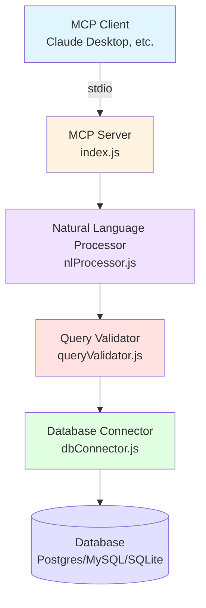
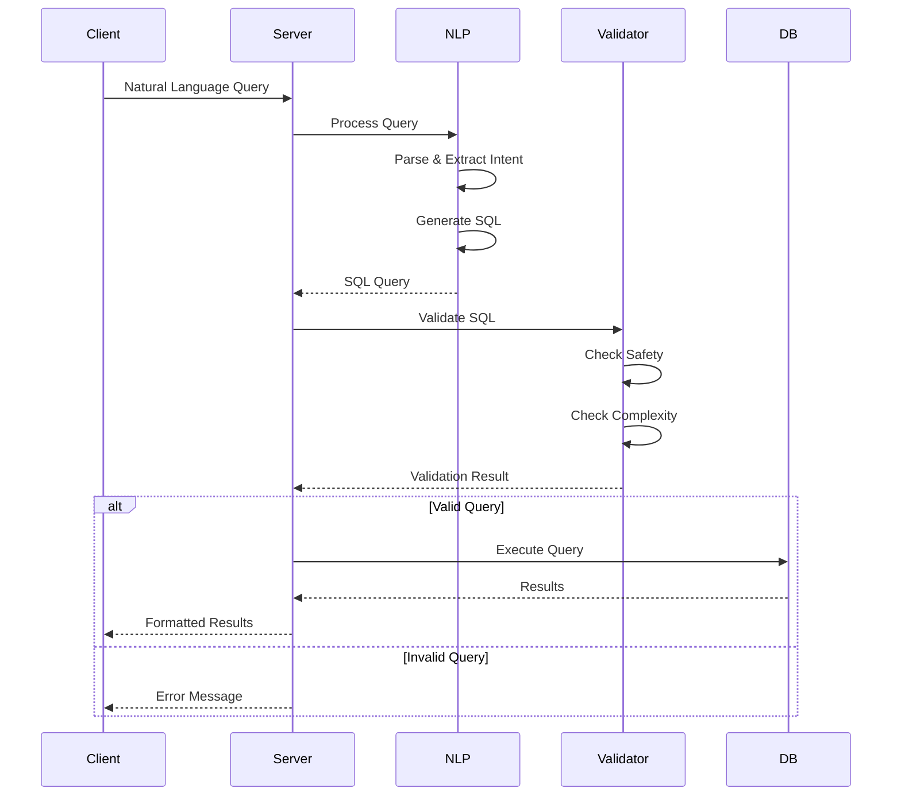
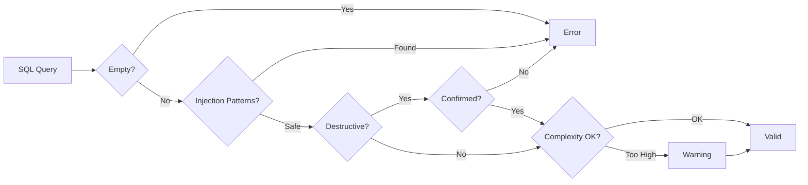
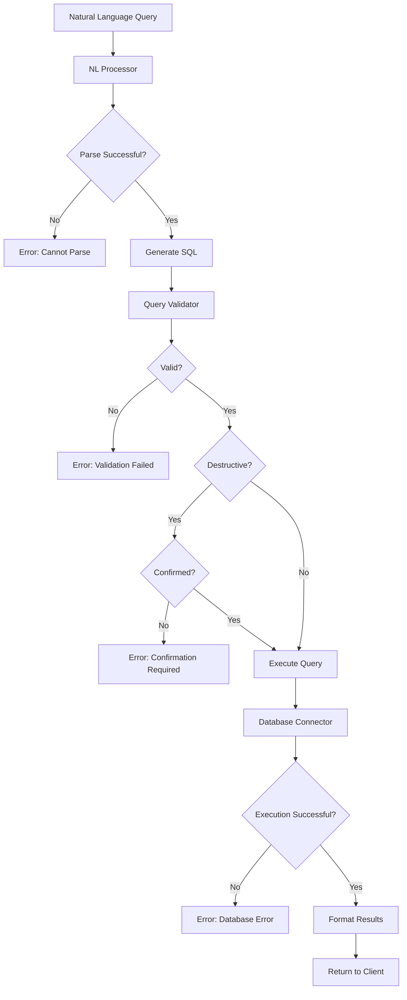
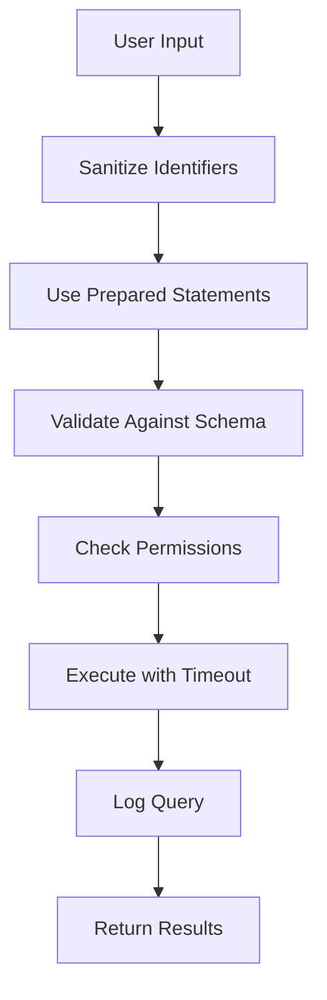

# NL-DB-Assistant Architecture

## Overview

The NL-DB-Assistant is a Model Context Protocol (MCP) server that enables natural language interaction with databases. It converts plain English queries into SQL and executes them safely against PostgreSQL, MySQL, or SQLite databases.

## System Architecture

### High-Level Architecture



### Component Flow



## Core Components

### 1. MCP Server (index.js)

**Responsibilities:**
- Initialize and manage the MCP server
- Handle tool registration and requests
- Coordinate between components
- Manage server lifecycle

**Tools Exposed:**
- `query_database`: Natural language query execution
- `get_schema`: Database schema introspection
- `execute_sql`: Raw SQL execution with validation
- `validate_query`: Query validation without execution

**Key Features:**
- Stdio transport for MCP communication
- Error handling and logging
- Graceful shutdown

### 2. Natural Language Processor (nlProcessor.js)

**Responsibilities:**
- Parse natural language queries
- Identify query intent (SELECT, INSERT, UPDATE, DELETE, COUNT)
- Extract entities (tables, columns, conditions)
- Generate SQL queries

**Pattern Matching:**
```
Natural Language → Intent Detection → Entity Extraction → SQL Generation
```

**Supported Patterns:**
- **SELECT**: "Show me all users", "Get orders from last week"
- **COUNT**: "How many active users", "Count orders by status"
- **INSERT**: "Add a new user to users table"
- **UPDATE**: "Update user status to active where id = 5"
- **DELETE**: "Delete inactive users"

**Filter Support:**
- WHERE clauses
- ORDER BY
- GROUP BY
- LIMIT
- Time-based filters (today, yesterday, last N days)

**Limitations:**
- Pattern-based (not LLM-powered)
- Requires schema awareness for table/column validation
- Complex joins may need manual SQL

### 3. Query Validator (queryValidator.js)

**Responsibilities:**
- SQL injection prevention
- Destructive operation detection
- Query complexity analysis
- Schema validation

**Safety Checks:**



**Validation Rules:**
- No multiple statements (prevents SQL injection)
- No dangerous patterns (comments, exec, etc.)
- Destructive operations require confirmation
- Complexity scoring based on JOINs, subqueries, aggregations

**Complexity Scoring:**
- Base: 10 points
- Each JOIN: +10 points
- Each subquery: +15 points
- Each aggregation: +5 points
- Each UNION: +10 points
- Each LIKE wildcard: +5 points

### 4. Database Connector (dbConnector.js)

**Responsibilities:**
- Multi-database support (PostgreSQL, MySQL, SQLite)
- Connection pooling
- Query execution with prepared statements
- Schema introspection
- Transaction management

**Database Support:**

| Feature | PostgreSQL | MySQL | SQLite |
|---------|-----------|-------|--------|
| Connection Pooling | ✓ | ✓ | N/A |
| Prepared Statements | ✓ | ✓ | ✓ |
| Schema Introspection | ✓ | ✓ | ✓ |
| Transactions | ✓ | ✓ | ✓ |

**Schema Caching:**
- Optional caching for performance
- Reduces database round-trips
- Configurable via environment variables

### 5. Configuration (config.js)

**Responsibilities:**
- Load environment variables
- Validate configuration
- Provide defaults
- Generate connection strings

**Configuration Categories:**
- Database settings
- Security options
- Logging preferences
- Feature flags

## Data Flow

### Query Execution Flow



## Security Architecture

### Defense Layers

1. **Input Validation**
   - Natural language parsing
   - SQL syntax validation
   - Parameter sanitization

2. **Query Validation**
   - SQL injection pattern detection
   - Destructive operation checks
   - Complexity limits

3. **Execution Safety**
   - Prepared statements
   - Connection pooling
   - Query timeouts

4. **Audit Logging**
   - Query logging (optional)
   - Error tracking
   - Performance monitoring

### Security Best Practices



## Performance Considerations

### Optimization Strategies

1. **Connection Pooling**
   - Reuse database connections
   - Configurable pool size
   - Automatic connection management

2. **Schema Caching**
   - Cache schema information
   - Reduce database queries
   - Invalidate on schema changes

3. **Query Timeout**
   - Prevent long-running queries
   - Configurable timeout
   - Resource protection

4. **Prepared Statements**
   - Query plan caching
   - Improved performance
   - Enhanced security

## Extension Points

### Adding New Database Support

1. Implement connection method in `dbConnector.js`
2. Add query execution handler
3. Implement schema introspection
4. Update configuration

### Enhancing NL Processing

1. Add new patterns to `nlProcessor.js`
2. Implement entity extraction
3. Add SQL generation logic
4. Test with various queries

### Custom Validators

1. Extend `QueryValidator` class
2. Add custom validation rules
3. Integrate with validation pipeline

## Error Handling

### Error Categories

1. **Configuration Errors**
   - Missing environment variables
   - Invalid database credentials
   - Connection failures

2. **Query Errors**
   - Parse failures
   - Validation errors
   - Execution errors

3. **System Errors**
   - Database unavailable
   - Timeout errors
   - Resource exhaustion

### Error Response Format

```json
{
  "content": [
    {
      "type": "text",
      "text": "Error: [Error message with context]"
    }
  ],
  "isError": true
}
```

## Deployment Considerations

### Environment Setup

1. **Development**
   - SQLite for quick testing
   - Verbose logging
   - Relaxed security

2. **Production**
   - PostgreSQL/MySQL
   - Minimal logging
   - Strict security
   - Connection pooling
   - Query timeouts

### Monitoring

- Query execution times
- Error rates
- Connection pool usage
- Schema cache hit rate

## Future Enhancements

### Planned Features

1. **LLM Integration**
   - Use LLMs for better NL understanding
   - Context-aware query generation
   - Query explanation

2. **Advanced Features**
   - Multi-database queries
   - Query result visualization
   - Query history and favorites
   - Performance optimization suggestions

3. **Security Enhancements**
   - Role-based access control
   - Table-level permissions
   - Query approval workflows

4. **Additional Database Support**
   - MongoDB
   - Redis
   - Cassandra

## References

- [Model Context Protocol Specification](https://modelcontextprotocol.io)
- [MCP SDK Documentation](https://github.com/modelcontextprotocol/sdk)
- [PostgreSQL Documentation](https://www.postgresql.org/docs/)
- [MySQL Documentation](https://dev.mysql.com/doc/)
- [SQLite Documentation](https://www.sqlite.org/docs.html)
